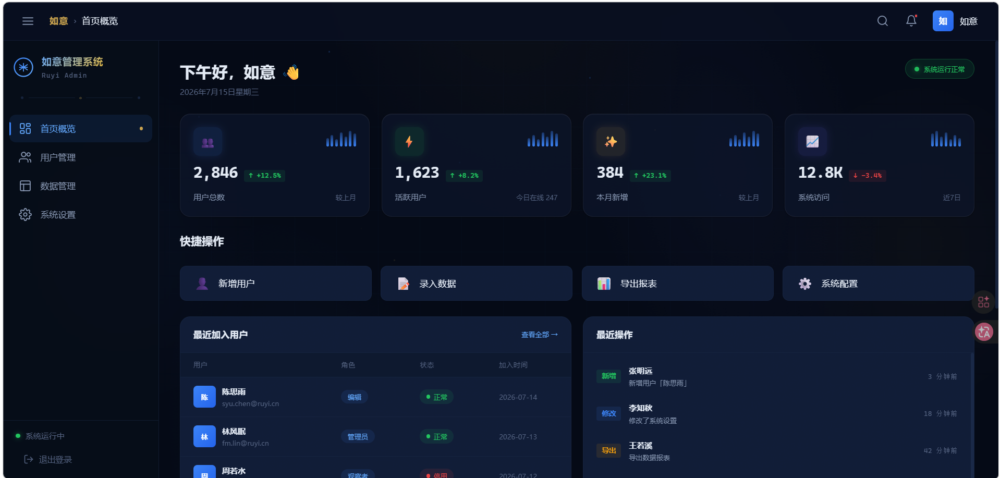

# 🏯 如意管理系统 · Ruyi Admin

<div align="center">



**如意国风科技蓝 · 现代化通用后台管理模板**

[](https://react.dev)
[](https://vite.dev)
[](./LICENSE)

</div>

---

## 📖 简介

**如意管理系统** 是一套开箱即用的通用后台管理前端模板。融合 **中国传统美学** 与 **现代科技感**，采用「如意国风科技蓝」主题 —— 深墨蓝为底，科技蓝为骨，如意金为魂。

> 如意，吉祥如意，万事如意。我是你最忠实的管家，最聪明的助手。

---

## ✨ 特性

### 🎨 视觉效果
- **三级玻璃拟态卡片** — 标准 / 悬浮 3D / 尊享（锥形渐变旋转边框 + 光标跟随聚光）
- **动态深空背景** — 20秒轨道旋转渐变 + 15秒漂移光池
- **科技网格叠加** — 64px 网格 + 径向暗角遮罩
- **噪点纹理** — SVG `feTurbulence` 分形噪点，打破「过于干净」的数字感
- **粒子浮点场** — 纯 CSS 驱动的微光粒子漂浮动画
- **Spotlight 光标效果** — 卡片鼠标跟随径向高亮
- **微动画体系** — 脉冲指示器、闪烁文字、涟漪按钮、骨架屏加载、页面交错入场

### 🧩 组件库
- **7 种按钮变体** — Primary / Secondary / Ghost / Danger / Gold / Outline / Icon × 4 尺寸
- **4 级玻璃卡片** — 默认 / 标准玻璃 / 悬浮 3D / 尊享动效
- **完整表单系统** — Input / Select / Textarea / Checkbox / Radio / Toggle Switch
- **数据表格** — 玻璃态粘性表头，渐变下划线，行悬停高亮
- **徽章标签** — 6 色 × 3 尺寸，带圆点指示器
- **头像 / 骨架屏 / 分割线 / 下拉菜单 / 进度条 / 通知吐司 / 空状态**

### 🏗️ 架构
- **零 UI 框架依赖** — 纯 CSS + React，不依赖 Ant Design / MUI
- **设计令牌体系** — 11 区段完整 CSS 自定义属性，一键换肤
- **深色/浅色双模** — `data-theme` 驱动，覆盖全部色值
- **领域驱动目录** — `components/ui/` → `features/` → `hooks/` → `utils/`
- **响应式布局** — 固定顶栏 + 可折叠侧栏 + 自适应滚动内容区

---

## 🚀 快速开始

```bash
# 1. 克隆项目
git clone https://github.com/manman-linlin/ruyi-admin.git
cd ruyi-admin/frontend

# 2. 安装依赖
npm install

# 3. 启动开发服务器
npm run dev

# 4. 打开浏览器
# http://localhost:5173
```

---

## 📂 项目结构

```
如意管理系统/
├── frontend/                     # React 前端
│   ├── public/
│   │   └── favicon.svg           # 如意品牌图标
│   ├── src/
│   │   ├── main.jsx              # 入口：挂载 Provider + Router
│   │   ├── App.jsx               # 顶层路由表
│   │   │
│   │   ├── styles/               # 🎨 设计系统（CSS 令牌 + 特效 + 组件样式）
│   │   │   ├── design-tokens.css # 11区段完整设计令牌（颜色/排版/间距/阴影/动效）
│   │   │   ├── effects.css       # 背景动效 / 三级玻璃卡片 / 聚光灯 / 骨架屏 / 模态框
│   │   │   └── components.css    # 13类组件视觉规范（按钮/表单/表格/徽章/头像...）
│   │   │
│   │   ├── components/           # 🧩 通用组件
│   │   │   ├── ui/               # 原子 UI 组件（零业务依赖）
│   │   │   │   ├── Icon.jsx      #   24个 SVG 图标集
│   │   │   │   ├── Button.jsx    #   7变体 × 4尺寸 按钮
│   │   │   │   ├── Card.jsx      #   4层级玻璃卡片
│   │   │   │   ├── Badge.jsx     #   6色徽章标签
│   │   │   │   ├── Avatar.jsx    #   4尺寸头像
│   │   │   │   ├── Skeleton.jsx  #   骨架屏加载占位
│   │   │   │   └── Divider.jsx   #   分割线（普通/装饰）
│   │   │   └── Layout.jsx/.css   # 主布局壳（顶栏 + 侧栏 + 内容区 + 背景层）
│   │   │
│   │   ├── features/             # 📦 功能模块（按业务域拆分）
│   │   │   ├── dashboard/        # 仪表盘首页
│   │   │   │   ├── Dashboard.jsx/.css    # 页面编排
│   │   │   │   └── components/           # 子组件
│   │   │   │       ├── WelcomeBar.jsx    #   问候栏
│   │   │   │       ├── StatCard.jsx      #   统计卡片（含 Spotlight）
│   │   │   │       ├── QuickActions.jsx  #   快捷操作
│   │   │   │       ├── RecentUsers.jsx   #   最近用户表格
│   │   │   │       ├── ActivityLog.jsx   #   操作日志时间线
│   │   │   │       └── SystemInfo.jsx    #   系统信息面板
│   │   │   ├── users/            # 用户管理（桩）
│   │   │   ├── data/             # 数据管理（桩）
│   │   │   └── settings/         # 系统设置（桩）
│   │   │
│   │   ├── context/              # 🔄 React Context
│   │   │   ├── ThemeContext.jsx   # 主题/强调色切换
│   │   │   └── SidebarContext.jsx # 侧栏折叠 + 移动端响应
│   │   │
│   │   ├── hooks/                # 🪝 自定义 Hooks
│   │   │   ├── useSpotlight.js   # 光标跟随聚光效果
│   │   │   ├── useDebounce.js    # 防抖
│   │   │   ├── useLocalStorage.js# 持久化存储
│   │   │   ├── useMediaQuery.js  # 响应式断点
│   │   │   └── useClickOutside.js# 外部点击检测
│   │   │
│   │   ├── utils/                # 🔧 工具函数
│   │   │   ├── cn.js             # className 合并
│   │   │   ├── formatters.js     # 日期/数字格式化
│   │   │   └── constants.js      # 导航/面包屑/图标名常量
│   │   │
│   │   └── mock/                 # 🎭 Mock 数据层
│   │       └── data.js           # 统计数据 / 用户 / 日志 / 系统信息
│   │
│   └── package.json
│
├── backend/                      # Go/Gin 后端（待开发）
├── screenshot.png                # 界面截图
└── README.md
```

---

## 🎨 设计系统

### 色彩体系

| 角色 | 色值 | 用途 |
|------|------|------|
| 深墨 `--ink-deep` | `#050a16` | 最深背景 |
| 墨底 `--ink-base` | `#090f20` | 基础底色 |
| 墨卡 `--ink-card` | `#111d37` | 卡片表面 |
| 科技蓝 `--accent` | `#3b82f6` | 主强调色 |
| 如意金 `--gold` | `#c9a24e` | 点缀金色 |
| 青绿 `--success` | `#22c55e` | 成功/在线 |
| 赤红 `--danger` | `#ef4444` | 危险/错误 |

### 布局参数

| 参数 | 值 |
|------|-----|
| 顶栏高度 `--header-h` | 60px |
| 侧栏宽度 `--sidebar-w` | 240px（折叠 64px） |
| 内容最大宽 `--content-max-w` | 1280px |
| 模糊值 `--blur-medium` | 8px ~ `--blur-heavy` 24px |

---

## 🛠️ 技术栈

| 层 | 技术 |
|----|------|
| 框架 | React 19 |
| 构建 | Vite 8 |
| 路由 | React Router DOM v7 |
| 样式 | CSS Custom Properties + `@property` + `backdrop-filter` |
| 状态 | React Context + Custom Hooks |
| 数据 | Mock 层（可快速切换真实 API） |
| 后端 | Go / Gin（待开发） |

---

## 🔌 二次开发指南

### 换肤

在任一 CSS 文件中覆盖 `:root` 变量即可：

```css
:root {
  --accent: #8b5cf6;        /* 科技蓝 → 紫色 */
  --gold:   #f59e0b;        /* 如意金 → 琥珀 */
}
```

### 添加新页面

1. 在 `features/` 下新建目录，创建页面组件
2. 在 `App.jsx` 添加路由
3. 在 `utils/constants.js` 添加导航项

### 切换到真实 API

修改 `services/` 层（待创建），将 Mock 调用替换为真实 HTTP 请求。

---

## 📋 路线图

- [x] 如意国风科技蓝主题
- [x] 三级玻璃拟态卡片系统
- [x] 动态背景 + 噪点 + 粒子场
- [x] Spotlight 光标跟随
- [x] 完整 UI 组件库（7 组件）
- [x] 仪表盘首页（统计卡片 + 用户表格 + 操作日志）
- [ ] Go/Gin 后端 API
- [ ] 用户管理 CRUD
- [ ] 数据管理（表格 + 导入导出）
- [ ] 系统设置（主题配置面板）
- [ ] 登录/鉴权（JWT）
- [ ] RBAC 权限系统
- [ ] 图表集成（ECharts/Recharts）
- [ ] TypeScript 迁移

---

## 📄 License

MIT © 2026 如意

---

<div align="center">

**如意管理系统** — 吉祥如意，万事如意 🏯

</div>
